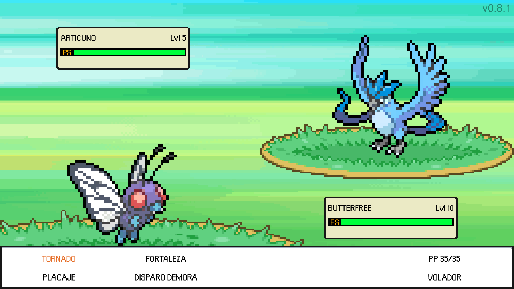

# _F6X POKEMON 2D_

- **Description :**
  - **Pokemon 2D game like in Unity.**
  - **This project is for learning purposes only.**

---

- **Controls :**
  - **Move Up : `W / ↑`**
  - **Move Down : `S / ↓`**
  - **Move Right : `D / →`**
  - **Move Left : `A / ←`**
  - **Exit Game : `Escape`**

---

- **Stack :**
  - **F6X POKEMON 2D** : `0.7.0`
  - **Unity** : `2019.3.6f1`

---

- **Credits :**
  - **Author : [FANTAS666X](https://github.com/FANTAS666IXI)**
  - **Guide : [Game Dev Experiments](https://www.youtube.com/watch?v=_Pm16a18zy8&list=PLLf84Zj7U26kfPQ00JVI2nIoozuPkykDX&index=1)**
  - **Sprites : [WikiDex](https://www.wikidex.net/wiki/WikiDex), [ArMM1998](https://opengameart.org/content/zelda-like-tilesets-and-sprites)**